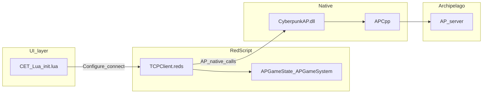

# Agent / contributor context

This file is the entry point for **language models and humans** working on the Cyberpunk 2077 Archipelago mod. It summarizes repository layout, architectural boundaries, and style expectations. User-facing install steps, requirements, and warnings live in [README.md](README.md).

## What this project is

A **Cyberpunk 2077** integration for [Archipelago](https://archipelago.gg/): in-game logic in **RedScript**, a **Cyber Engine Tweaks (CET)** Lua UI, a **RED4ext** native plugin (`CyberpunkAP.dll`) that embeds the **APCpp** client, and a Python **APWorld** under `worlds/cyberpunk2077/` for generation and logic.

## Dual workspace (this repo vs Archipelago core)

If you have two roots open (common for this project):

| Location | Role |
|----------|------|
| **This repository** (`Cyberpunk_Archipelago_Mod`) | First-party mod: `Cyberpunk2077/`, `worlds/cyberpunk2077/`, `native/cyberpunk_ap_plugin/`, and vendored native deps. |
| **Archipelago core** (separate clone, e.g. sibling folder `Archipelago`) | Upstream framework: `BaseClasses`, `worlds.AutoWorld`, CI, and canonical **`ruff.toml`** for Python style. |

World Python code **imports** Archipelago core modules; lint/format decisions for that code should follow **Archipelago’s** `ruff.toml`, not an ad-hoc subset unless the maintainers add a dedicated config here.

## Repository layout

### `Cyberpunk2077/` — game deploy tree

Paths mirror what goes under a Cyberpunk 2077 install:

| Area | Path (under `Cyberpunk2077/`) | Purpose |
|------|-------------------------------|---------|
| RedScript | `r6/scripts/CyberPunkArchipelago/Cyberpunk2077_Archipelago_Client/*.reds` | Game integration: networking bridge to native code, state, items, districts, quests, logging. |
| CET | `bin/x64/plugins/cyber_engine_tweaks/mods/Cyberpunk_Archipelago_Bridge/init.lua` | In-game UI (connection settings, status). |
| RED4ext | `red4ext/plugins/CyberpunkAP/` | Built **`CyberpunkAP.dll`** (and related outputs from the native build). |

**Stable path quirk:** the RedScript folder uses **`CyberPunkArchipelago`** (capital **P**). Do not rename it casually; doing so breaks installs and references.

### `worlds/cyberpunk2077/` — APWorld (Python)

Randomizer definitions and rules:

- `__init__.py` — `Cyberpunk2077World`, `game`, `base_id`, web metadata.
- `items.py`, `locations.py`, `regions.py`, `rules.py`, `options.py` — data and logic.
- `tools/generate_redscript_ap_mappings.py` — tooling tied to RedScript ID mappings.

**Consistency contract:** numeric/name IDs and strings exposed to the game must stay aligned with RedScript, especially [Cyberpunk2077/r6/scripts/CyberPunkArchipelago/Cyberpunk2077_Archipelago_Client/APArchipelagoIdMappings.reds](Cyberpunk2077/r6/scripts/CyberPunkArchipelago/Cyberpunk2077_Archipelago_Client/APArchipelagoIdMappings.reds) and native expectations. After changing generated mappings, regenerate or update hand-maintained files as appropriate.

### `native/` — RED4ext plugin and dependencies

See [native/README.md](native/README.md) for build commands and submodule setup.

| Path | Purpose |
|------|---------|
| `native/cyberpunk_ap_plugin/` | **First-party** C++ RED4ext plugin (sources you should edit for native behavior). |
| `native/APCpp/` | Vendored Archipelago C++ client (do not mass-reformat). |
| `native/RED4ext.SDK/`, `native/RED4ext/`, `native/Red4Ext-template/` | SDK / reference / scaffold (upstream-owned layout and formatters). |

### `cyberpunk_archipelago-wolvenkitproj/` — WolvenKit / TweakXL

TweakDB YAML for vendor sanity lives under `source/resources/r6/tweaks/cyberpunk_archipelago-wolvenkitproj/` as **`vendor_checks_0_common.yaml`** through **`vendor_checks_5_*.yaml`** (split by vendor category; `0_` must stay first for load order). See [vendor_checks_README.md](cyberpunk_archipelago-wolvenkitproj/source/resources/r6/tweaks/cyberpunk_archipelago-wolvenkitproj/vendor_checks_README.md) in that folder.
Release automation builds and syncs this project via `tools/build_wolvenkit_project.py` before packaging `CyberpunkArchipelagoMod_(version).zip`.

## Architecture (data flow)



- **CET** calls into **RedScript** services (for example `Archipelago.TCPClient`) for connect/configure and status.
- **TCPClient.reds** forwards to **native** functions declared in [Cyberpunk2077/r6/scripts/CyberPunkArchipelago/Cyberpunk2077_Archipelago_Client/APNativeBindings.reds](Cyberpunk2077/r6/scripts/CyberPunkArchipelago/Cyberpunk2077_Archipelago_Client/APNativeBindings.reds); the implementation lives in **`CyberpunkAP.dll`** (APCpp and bridge code).
- **APGameState** / **APGameSystem** hold and drive game-side state (items, districts, traps, phone UI, etc.).

## Optional CyberpunkNewGamePlus bridge

- `APNGPlusBridge.reds` provides an optional runtime integration for [CyberpunkNewGamePlus](https://github.com/alphanin9/CyberpunkNewGamePlus) (GPL-3.0). Keep this integration RedScript-only and fact-driven (`ngplus_*` quest facts) so AP remains functional when NG+ is not installed.
- Do not vendor or bundle NG+ code/artifacts into this repository or release zips. Treat NG+ as a separate user-installed dependency.

## Hard invariant: natives and DLL stay paired

Declarations in [APNativeBindings.reds](Cyberpunk2077/r6/scripts/CyberPunkArchipelago/Cyberpunk2077_Archipelago_Client/APNativeBindings.reds) **must match** the exported API of the shipped **`CyberpunkAP.dll`**.

If you add, remove, or rename natives in RedScript, **rebuild** the plugin and deploy **both** updated scripts and the new DLL (see [README.md](README.md) and [native/README.md](native/README.md)). Mismatches show up as invalid native definitions or runtime failures.

## Naming conventions

### RedScript

- Top-level module: **`Archipelago`** (`module Archipelago` in `.reds` files).
- Many game-facing types use the **`AP`** prefix (`APGameState`, `APGameSystem`, `APConstants`, …). **`TCPClient`** is the scriptable service used for Archipelago connection from CET.

### Python world

- **`game`** string must stay **`"Cyberpunk 2077"`** and consistent everywhere (including RedScript game name where applicable).
- **`base_id = 2077000`** in `Cyberpunk2077World` must stay consistent with comments and ID layout in `items.py` / `locations.py`.

## First-party vs vendored code

**Edit freely (subject to review):**

- `Cyberpunk2077/r6/scripts/.../*.reds`
- `Cyberpunk2077/bin/x64/plugins/cyber_engine_tweaks/mods/.../*.lua`
- `worlds/cyberpunk2077/**/*.py`
- `native/cyberpunk_ap_plugin/**`

**Treat as vendored / upstream-shaped; avoid drive-by reformat or unrelated edits:**

- `native/APCpp/**`
- `native/RED4ext.SDK/**`
- `native/RED4ext/**`
- `native/Red4Ext-template/**`

Submodules under `native/` may ship their own `.clang-format` or `.editorconfig`; those apply **inside** those trees.

### C++ style (first-party plugin)

First-party sources under `native/cyberpunk_ap_plugin/` should match the style of the RED4ext ecosystem (Allman-style braces, Microsoft-based clang-format profile). Upstream reference: `native/RED4ext/.clang-format` (example entrypoint: `native/cyberpunk_ap_plugin/src/plugin.cpp`).

## Python: match Archipelago core `ruff`

World code should follow the **Archipelago** repository’s Ruff configuration: line length **120**, indent width **4**, target **Python 3.11**, and the `select` / `ignore` sets defined in Archipelago’s root `ruff.toml`.

**Practical check** when you have both repos on disk (paths are examples):

```bash
ruff check --config /path/to/Archipelago/ruff.toml /path/to/Cyberpunk_Archipelago_Mod/worlds/cyberpunk2077
```

Using Archipelago’s config ensures the same rules as core AP. If a future minimal `ruff.toml` is added **inside this repo**, it should mirror those settings; until then, prefer the command above or an equivalent editor integration.

## RedScript, Lua, Markdown (documented style only)

There is **no root `.editorconfig`** in this repo yet. For **new** edits, prefer:

- **UTF-8** encoding
- **LF** line endings
- **4 spaces** per indent level (matches existing RedScript, CET Lua, and Archipelago Python indent width)
- **No trailing whitespace** on lines you touch

Older files may still contain minor inconsistencies (for example stray spaces after `{` on some lines). Clean those opportunistically when editing nearby code; avoid huge whitespace-only churn across the tree unless maintainers request it.

## Clone and build (pointers)

After clone:

```bash
git submodule update --init --recursive
```

Native **Release** build from `native/` (Windows):

```bash
cmake -S . -B build
cmake --build build --config Release
```

Details and output paths: [native/README.md](native/README.md).

## Where not to duplicate docs

- Installation, mod dependencies, Linux/Wine notes, credits: [README.md](README.md)
- Native submodule layout and APCpp notes: [native/README.md](native/README.md)

---

*Maintainers: optional follow-ups include adding a minimal `ruff.toml` here mirroring Archipelago, or a root `.editorconfig` for enforced charset/indent/trim.*
